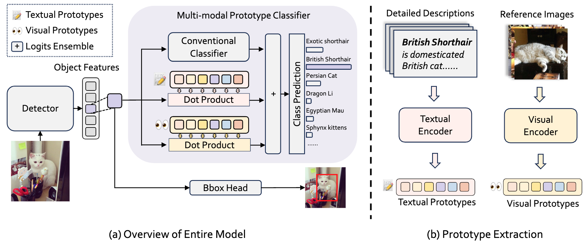

# 

<div align="center">
<h2><font size=3>Comprehensive Multi-Modal Prototypes are Simple and Effective Classifiers <br> for Vast-Vocabulary Object Detection</h2>
<h4>

Yitong Chen<sup>1,2*</sup>, [Wenhao Yao](https://william-yao-2000.github.io/)<sup>1*</sup>, [Lingchen Meng](https://menglcool.github.io/)<sup>1*</sup>, Sihong Wu<sup>1</sup>, [Zuxuan Wu](https://zxwu.azurewebsites.net/)<sup>1,2&dagger;</sup>, [Yu-Gang Jiang](https://scholar.google.com/citations?user=f3_FP8AAAAAJ&hl=en)<sup>1</sup>,

<sup>1</sup> Shanghai Key Lab of Intell. Info. Processing, School of CS, Fudan University, <br>
<sup>2</sup> Shanghai Innovation Institute

 <sup>*</sup> Equal contributions; <sup>&dagger;</sup> Corresponding author.

[[`Paper AAAI-25`](https://arxiv.org/abs/2412.17800)] 
[[ `Checkpoints`(Coming soon)](#models)] 
</div>


## Introduction

We introduce Prova, a multi-modal prototype classifier for vast-vocabulary object detection. Prova extracts comprehensive multi-modal prototypes as initialization of alignment classifiers to tackle the vast-vocabulary object recognition failure problem. On V3Det, this simple method greatly enhances the performance among one-stage, two-stage, and DETR-based detectors with only additional projection layers in both supervised and open-vocabulary settings. In particular, Prova improves Faster R-CNN, FCOS, and DINO by 3.3, 6.2, and 2.9 AP respectively in the supervised setting of V3Det. For the open-vocabulary setting, Prova achieves a new state-of-the-art performance with 32.8 base AP and 11.0 novel AP, which is of 2.6 and 4.3 gain over the previous methods.


## Cookbook
Our Prova, as an additional prototype-based classfication head, is easy to implement in any codebase. We release the training of DINO-Prova on V3Det built upon [RichSem](https://github.com/MengLcool/RichSem) codebase.
### Install
```
conda init
conda create -n Prova python=3.8 -y
conda activate Prova
pip install torch==1.9.0+cu111 torchvision==0.10.0+cu111 torchaudio==0.9.0 -f https://download.pytorch.org/whl/torch_stable.html

# install packages
pip install numpy==1.21.6
pip install scipy termcolor addict yapf==0.40.0 timm==0.5.4 lvis pycocotools ftfy regex PyWavelets mmengine
python -m pip install 'git+https://github.com/facebookresearch/detectron2.git'
cd models/richsem/ops
python setup.py build install --user
cd ../../..
```
### Multi-Modal Prototypes
The [prototypes]() should be organized as:
```
Prova
  └── prototypes
      ├── visual_prototypes_v3det.pt
      ├── textual_prototypes_v3det.pt
      └── visual_prototypes_v3det_ovd.pt 
```
### Data
The [ImageNet](https://huggingface.co/datasets/yhcao/V3Det_ImageNet21k_Cls_100) dataset and [V3Det](https://v3det.openxlab.org.cn/) dataset should be organized as:
```
Prova
  └── DATASET
      ├── V3Det_ImageNet21k_Cls_100/
      └── v3det
          ├── annotations/
          │      ├── category_name_13204_v3det_2023_v1.txt
          │      └── v3det_2023_v1_category_tree.json
          ├── images/
          ├── test/
          ├── v3det_2023_v1_category_tree.json
          ├── v3det_2023_v1_train_ovd_base.json
          ├── v3det_2023_v1_train.json
          ├── v3det_2023_v1_val.json
          └── v3det_2023_v1_val_tiny.json  
```
[v3det_2023_v1_val_tiny.json]() is a subset for v3det val set and utilized to speed validation process up.

### Training
Train DINO-Prova in supervised setting w/o ImageNet:
```
bash scripts/prova_dist.sh 8 --output_dir your/output_dir -c config/Prova/prova_r50_1k_v3det.py --dataset_file v3det --data_path DATASET/v3det
```

Train DINO-Prova in open-vocabulary setting w/ ImageNet:
```
bash scripts/prova_dist.sh 8 --output_dir your/output_dir -c config/Prova/prova_r50_22k_v3det_ovd_w_inet --dataset_file v3det --data_path DATASET/v3det
```

### Testing
Test DINO-Prova with 8 GPUs:
```
bash scripts/prova_dist.sh 8 --output_dir your/output_dir/full_eval -c config/Prova/prova_r50_1k_v3det.py --dataset_file v3det_full --data_path DATASET/v3det --test --resume your/checkpoint.pth

python evaluation/eval_v3det.py your/output_dir/full_eval/bbox_pred.json | tee -a your/output_dir/full_eval/result.txt
```
## Models
### Prova on Supervised V3Det
| Model  | Backbone | Epochs | $AP$ | $AP_{50}$| $AP_{75}$| Config | Download |
| ------ | -------- | ------- | ------ | ------ | ----- | ----- | ----- |
| DINO | RN50  |24 | 33.5 | 37.7 | 35.0 | - | - |
| DINO-Prova | RN50 | 24 | 36.4 | 41.3 | 38.1 | [config](config/Prova/prova_r50_1k_v3det.py) | [model]() |
| DINO | SwinBase  |24 | 42.0 | 46.8 | 43.9 | - | - |
| DINO-Prova | SwinBase | 24 | 44.5 | 49.9 | 46.6 | [config](config/Prova/prova_swinb_1k_v3det.py) | - |
| DINO-Prova-22K | SwinBase-22k | 24 | 50.3 | 56.1 | 52.6 | [config](config/Prova/prova_swinb_22k_v3det_w_inet.py) | [model]() |

### Prova on Open-Vocabulary V3Det
| Model  | Backbone | Epochs | $AP_{base}$ | $AP_{novel}$| $AP_{final}$| Config | Download |
| ------ | -------- | ------- | ------ | ------ | ----- | ----- | ----- |
| DINO* | [R50-22k](https://miil-public-eu.oss-eu-central-1.aliyuncs.com/model-zoo/ImageNet_21K_P/models/resnet50_miil_21k.pth)  |24 | 19.0 | 1.9 | 10.5 | - | - |
| DINO-Prova | [R50-22k](https://miil-public-eu.oss-eu-central-1.aliyuncs.com/model-zoo/ImageNet_21K_P/models/resnet50_miil_21k.pth) | 24 | 31.4 | 9.5 | 20.5 | [config](config/Prova/prova_r50_22k_v3det_ovd.py) | - |
| DINO-Prova-22K |  [R50-22k](https://miil-public-eu.oss-eu-central-1.aliyuncs.com/model-zoo/ImageNet_21K_P/models/resnet50_miil_21k.pth)| 24 | 32.8 | 11.0 | 21.9 | [config](config/Prova/prova_r50_22k_v3det_ovd_w_inet.py) | [model]() |

## Acknowledgement
Thanks for these excellent opensource projects: 
* [RichSem](https://github.com/MengLcool/RichSem)  
* [DINO](https://github.com/IDEA-Research/DINO)  
* [CLIP](https://github.com/openai/CLIP) 

## Citation

If you find this project useful for your research, please use the following BibTeX entry.
```bibtex

```
